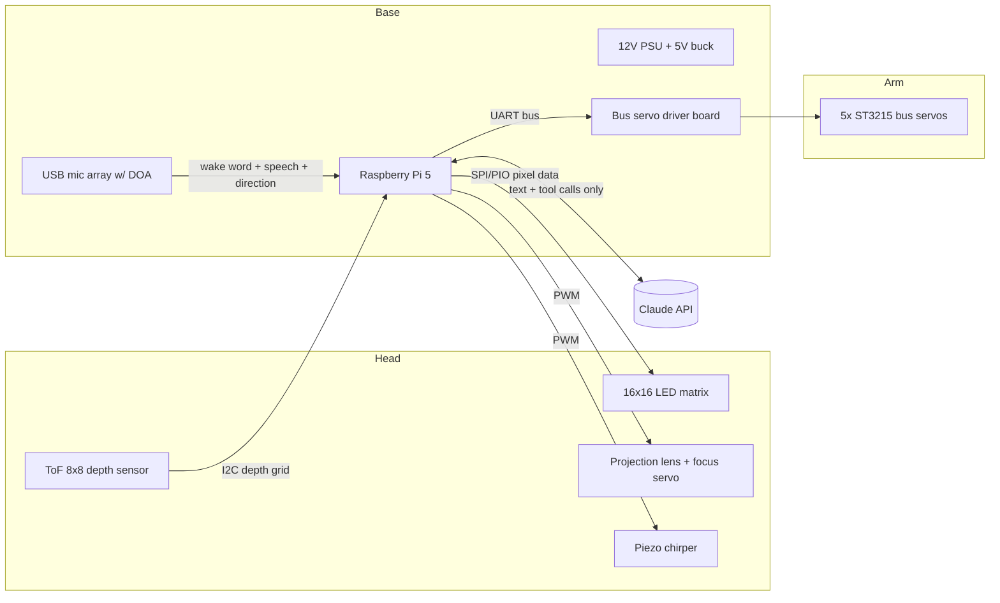

# Design Document — Pixar-Style Animatronic Lamp

Status: **draft for review** · Last updated: 2026-08-29

## 1. Vision

A desk lamp with the soul of Luxo Jr.: a silent, expressive robot that lives on
a desk (or shelf), listens when spoken to, and responds only through **motion**,
a **projected 16×16 pixel display**, and **non-verbal piezo chirps**. Claude is
the mind; the body is the interface.

Guiding principles, in priority order:

1. **Motion quality is the product.** Anticipation, ease-in/ease-out, follow-through,
   secondary motion, gaze. A lamp that moves beautifully and does little beats a
   lamp that does everything and moves like a printer.
2. **Constraint is character.** 256 pixels and a piezo beeper are the *native
   medium*, not placeholders. The visual/sound language is designed for them.
3. **Privacy by physics.** No camera. Perception uses sensors that are
   incapable of producing imagery: a multizone time-of-flight depth sensor and
   a microphone array. Audio is processed on-device; only text leaves the lamp.
4. **Modular head.** The display module bolts to a standard interface so it can
   be swapped (light ring → matrix projector → anything else) without redesign.

Prior art worth stealing from: Pixar's *Luxo Jr.* (staging and timing), Apple's
**ELEGNT** research paper (Jan 2025 — expressive movement design for a
non-anthropomorphic lamp robot; strong taxonomy of functional vs. expressive
motion), and the SO-ARM100/101 open-source arms (proven low-cost serial-bus
servo mechanics).

## 2. Settled decisions

| # | Decision | Choice | Notes |
|---|----------|--------|-------|
| D1 | Voice | **None.** Motion + projection + chirps only | Canonical Luxo behavior; removes TTS/latency pressure |
| D2 | Display | **16×16 WS2812 matrix + projection lens**, likely final form | Head interface stays modular as cheap insurance |
| D3 | Sound | **Passive piezo**, PWM-driven chirps | No speaker, no audio DAC; "Game Boy" palette |
| D4 | Camera | **Never in v1.** ToF depth grid + mic DOA only | Camera module possible later, with hardware shutter + power LED |
| D5 | Power | Mains, single external 12 V PSU into the base | No battery |
| D6 | Compute | Raspberry Pi 5 (8 GB) in the base | Headroom for local STT |
| D7 | Actuators | 5× Feetech ST3215 serial-bus servos (12 V, 30 kg·cm) | Position feedback, daisy-chain, ~£15 each |
| D8 | Size | ~40 cm tall upright, base ~180 mm ⌀ | Luxo Jr. presence, desk-friendly |
| D9 | Fabrication | Bambu Lab A1 (256×256×256 mm bed), PETG/PLA | Every part fits the bed; base prints in one piece |
| D10 | CAD | Blender with parametric `bpy` scripts in `cad/` | Regenerable geometry, STL export |
| D11 | Budget | £300–500 all-in | Current estimate ~£350, see BOM |

Open questions (fine to defer):

- O1: Exact character proportions/shell aesthetic — iterate in Blender renders.
- O2: Whether the shoulder needs spring counterbalance (decide after torque
  test on the bench; mounting bosses for a spring are designed in regardless).
- O3: Local STT (faster-whisper on the Pi) vs. cloud STT — start local for
  privacy; fall back if latency disappoints.

## 3. System overview



The interaction loop:

1. **Idle**: subtle procedural "breathing" sway; occasional glances toward
   sounds (mic DOA) or motion (ToF deltas). Display shows a dim ambient face.
2. **Wake**: on-device wake word ("hey lamp" — final phrase TBD). The lamp
   *turns to face the speaker* (DOA angle → base yaw; ToF person-blob →
   head pitch) and perks up. Listening posture + listening glyph.
3. **Listen**: on-device STT transcribes. End-of-speech → acknowledgment nod +
   rising chirp, thinking posture + thinking animation. This staging absorbs
   Claude round-trip latency invisibly.
4. **Respond**: Claude returns a *performance* — a short choreography of
   emotes, display content, and chirps — which the behavior engine executes.
5. Return to idle.

## 4. Mechanical design

### 4.1 Kinematics — 5 DOF

| Joint | Axis | Range | Servo |
|-------|------|-------|-------|
| J1 base yaw | vertical | ±150° | ST3215 |
| J2 shoulder pitch | horizontal | ~-10°…+95° | ST3215 |
| J3 elbow pitch | horizontal | ~±110° | ST3215 |
| J4 head pitch | horizontal | ~±90° | ST3215 |
| J5 head roll | along head axis | ±60° | ST3215 |

Link lengths (target): shoulder→elbow **160 mm**, elbow→wrist **160 mm**,
wrist→lens plane ~70 mm. Upright height ≈ 400–420 mm including base.

J5 (head roll) is what makes the "curious head-tilt" read; it lives in the
head assembly, so its servo mass sits at the worst lever arm — the head must
stay light (budget below).

### 4.2 Torque budget (worst case: arm horizontal, fully extended)

Assumptions: head module ≤ 220 g (matrix 35 g, lens 40 g, focus servo 15 g,
roll servo 60 g shared with J5, shell 70 g); forearm structure 80 g; elbow
servo + bracket 110 g.

Moment about the shoulder ≈ 0.22 kg·33 cm + 0.11 kg·16 cm + 0.08 kg·24 cm +
structure ≈ **11–13 kg·cm static**; ×2 dynamic margin → 22–26 kg·cm.
The ST3215 at 12 V stalls at ~30 kg·cm, so this is *feasible but warm* under
sustained horizontal poses. Mitigations, in order:

1. **Choreography rarely holds full horizontal extension** (neither does Luxo).
2. **Spring counterbalance** at the shoulder, anglepoise-style — an extension
   spring across the joint cancels most of gravity's moment. Authentic to the
   lamp archetype and lets the servo work only against inertia. Mounting
   bosses included in the print from day one (open question O2).
3. Torque-limit + temperature readback in software (the ST3215 reports load,
   temperature, and voltage), easing into thermal-safe poses.

### 4.3 Base

180 mm ⌀ × ~60 mm printed drum, weighted (steel washers / sand pocket) so
fast arm moves can't tip it. Houses: Pi 5, servo driver, 5 V buck, piezo of
last resort (main piezo is in the head), cable strain relief, and the J1 yaw
servo driving a printed ring gear or direct horn mount on a thin-section
lazy-susan bearing. Single external 12 V brick enters via a rear DC jack.

### 4.4 Head module interface

The wrist ends in a standard mount so display modules are swappable (D2):

- 4× M3 heat-set inserts on a 40×40 mm bolt pattern
- One 8-pin JST-XH pigtail: 5 V, GND, matrix data, piezo PWM, focus PWM,
  I²C SDA/SCL (ToF), spare
- Design rule: any head module ≤ 220 g, center of mass within 35 mm of the
  mount plane

The ToF sensor mounts in the head *beside the lens*, looking where the lamp
looks — so "what the lamp sees" and "where it projects" share a frame.

### 4.5 Printing (Bambu A1)

All parts ≤ 200 mm in the longest dimension except the base drum (≤ 250 mm,
fits diagonal-safe on the 256 mm bed). Shell parts in PLA (aesthetic, matte);
load-bearing joints and servo brackets in PETG. Heat-set M3 inserts
throughout; no support-heavy geometry — every part designed with a flat
print face. Multi-colour accents optional via AMS lite.

## 5. Display: the matrix projector

Optical chain: **WS2812B 16×16 matrix (10 mm pitch → 160×160 mm emitter…**
too large for the head — so the head uses a **smaller-pitch matrix**
(target: flexible 16×16 panels come in ~10 mm pitch; rigid mini-pitch panels
exist at 4–5 mm giving a 64–80 mm square, which is what the head shade
comfortably houses; final pick in BOM) → **diffuser sheet** (kills inter-LED
gaps, at slight sharpness cost — tune by trying 1–3 sheet thicknesses) →
**condenser/biconvex projection lens** on a printed sliding focus rail driven
by a micro servo.

- **Focus** is open-loop: ToF gives distance-to-surface, a calibration lookup
  table maps distance → rail position. At 256 px the depth of field is
  generous; ±10 % distance error is invisible.
- **Brightness**: theoretical max draw of 256 LEDs is ~15 A at 5 V — capped
  in firmware at 25–30 % global brightness (~3 A worst case, ~1 A typical).
  Desk projection at 30–60 cm is comfortable indoors; wall projection at
  1.5–2 m wants dim lighting. Acceptable for the character (D2).
- **Keystone**: with head pitch known from servo feedback and surface plane
  from ToF, the renderer pre-warps (integer row/column shifts at this
  resolution — cheap).
- **Also still a lamp**: a plain "all pixels warm white at safe brightness"
  mode gives real task lighting through the same lens.

The 256-pixel visual language (to be developed in the simulator): a glyph
set (~emoji-like ideograms), 2-frame emotion faces, scrolling text (5×7 font,
~2 chars visible), meters/spinners, and a "thinking" animation family.

## 6. Perception & privacy

### 6.1 Sensors

- **ST VL53L7CX** multizone ToF (head): 8×8 depth zones, 90° diagonal FoV,
  ~15 Hz, range to ~3.5 m. Used for: projection surface finding (least-squares
  plane fit over zones), throw distance (focus + brightness), person presence
  and rough position (blob vs. background), "don't blind anyone" check
  (never project at a face-height blob at close range).
- **USB mic array with onboard DSP** (base, e.g. ReSpeaker family): far-field
  capture, beamforming, noise suppression, and **direction of arrival**
  exposed over USB. Used for: wake word capture, STT audio, and turn-to-face
  behavior. No echo cancellation needed — the lamp has no voice.

### 6.2 Privacy invariants

1. **No camera exists in the device.** The ToF's 64 distance values cannot
   form an identifying image. (A future camera module would require a
   physical shutter and hardwired power LED — out of scope for v1.)
2. **Audio never leaves the device.** Wake word (openWakeWord/Porcupine-class,
   on-device) and STT (faster-whisper on the Pi 5) run locally. Only the
   *transcript* is sent to the Claude API. If local STT proves too slow we
   revisit explicitly (open question O3) — it is a design change, not a knob.
3. **Hardware mic mute** switch on the base, cutting the array's USB power.
   Muted state shown on the display.
4. No audio/depth recording to disk; rolling buffers only, in RAM.

## 7. Sound: the piezo chirp language

Passive piezo disc driven by hardware PWM through a transistor (one GPIO).
Synthesizable parameters: pitch (~200 Hz–8 kHz), duration, pitch envelope
(chirp up/down/trill), amplitude envelope (via PWM duty), rhythm. A named
"sound font" — `ack`, `curious`, `happy`, `sad`, `alert`, `snore`, … — each a
~10-line envelope spec, triggerable by the behavior engine and by Claude.
Chirps accompany motion accents (never continuous noise).

## 8. Electronics & power

```
[12V 8A external brick]
   ├── 12V rail → bus servo driver → 5× ST3215 (daisy-chain)
   └── 12V→5V 6A buck
         ├── Raspberry Pi 5 (via USB-C or GPIO header power)
         ├── LED matrix (firmware-capped ~3A)
         ├── VL53L7CX (I²C, 3V3 via Pi)
         └── focus micro-servo, piezo driver
```

- Servo bus: Pi UART ↔ Waveshare/Feetech serial bus driver board (TTL
  half-duplex). All five joints on one 3-wire daisy chain.
- Matrix data: WS2812 single-wire protocol from the Pi (SPI-driven, e.g.
  `pi5neo`/`rpi-ws281x`-class library with a 3.3→5 V level shifter).
- Wiring through the arm: the 8-pin head pigtail + servo chain routed through
  printed cable channels in the links; service loops at each joint.
- Kill behavior: watchdog in the daemon — on crash, servos go torque-off
  (lamp slumps gracefully rather than freezing rigid; also endearing).

## 9. Software architecture

One Python daemon (`lamp/`) on the Pi, systemd-managed, structured as
processes/async tasks around a shared state bus:

- **perception**: wake word, streaming STT (faster-whisper), mic DOA reader,
  ToF plane/person tracker.
- **behavior**: the character state machine (idle / orienting / listening /
  thinking / performing / resting). Owns *what the lamp does*; degrades
  gracefully offline (no API ⇒ still a living lamp, just nonverbal).
- **animation**: 50 Hz pose interpolator — keyframed emotes + procedural
  layers (breathing, gaze tracking via simple 2-joint IK, micro-fidgets),
  easing curves, torque/temperature guards. Servo abstraction over the bus.
- **display**: 16×16 framebuffer, glyph/font/animation assets, keystone warp,
  brightness governor, focus controller.
- **sound**: chirp synthesizer (PWM envelopes), sound font.
- **brain**: Claude integration (below).
- **sim**: a desktop simulator (side-view lamp rig + matrix preview + chirp
  audio) so character work starts before hardware exists and regression-tests
  choreography after.

### 9.1 Claude integration

Python `anthropic` SDK, Messages API, default model **`claude-opus-5`**
(configurable; adaptive thinking on by default, `output_config.effort` set
low/medium for snappy conversational turns — the transcript in, performance
out loop is not a hard reasoning task). Streaming on, so choreography can
begin as soon as the first tool call arrives.

Claude receives: the transcript, recent conversation history, and a compact
world state (person present/direction, current pose, surface type, time of
day). The system prompt frames Claude as *the lamp* — a mute, curious
character who communicates in gesture and glyphs, with tools:

- `perform(script)` — a timed sequence of steps, each combining
  `emote(name, intensity)`, `display(glyph | text | animation)`,
  `chirp(name)`, `look_at(person | surface | object_direction)`. The
  animation engine compiles it; the API returns one performance per turn.
- `set_lamp_state(...)` — task-light mode, brightness, do-not-disturb.

Long-form answers ("what's the weather this week?") become glyph + short
scrolling-text performances; the prompt explicitly rewards brevity and
pictograms over prose. System prompt and tool definitions stay byte-stable
for prompt caching; volatile world state rides in the user turn.

## 10. Build phases

| Phase | Deliverable | Exit criterion |
|-------|-------------|----------------|
| 0 Concept | this document | user sign-off ✅ |
| 1 Order & simulate | BOM ordered; `sim/` running; emote library v0; glyph font v0 | 10 emotes + 15 glyphs reviewable on screen |
| 2 Bench bring-up | servos moving on the bus with eased motion; matrix projecting through hand-held lens; chirps; ToF plane fit demo | "breathing" motion on a bare servo chain; legible 1 m projection |
| 3 Body | Blender CAD, printed arm + base, assembled, cable-routed | lamp holds poses, no overheat in 30 min idle choreography |
| 4 Senses | wake word → orient → listen → transcript, all on-device | says-my-name test from 3 m, 90 % orient accuracy |
| 5 Mind | Claude performances end-to-end; personality tuning | ask it something; it answers charmingly in ≤ 3 s to first motion |
| 6 Polish | shell aesthetics, sound font, idle-life richness, task-light UX | it lives on the desk and you stop noticing the machinery |

Phase 1 starts only after BOM review (docs/BOM.md, UK-sourced, in progress).
